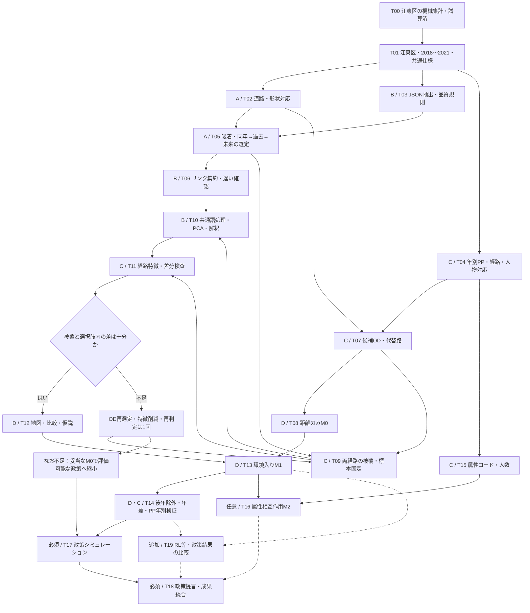

# 江東区・みちよみを用いた経路選択モデル：実行可能性と4人・2日間の作業計画

作成日・改訂日：2026-09-08（江東区・複数年・政策評価必須版）。担当A〜Dはチームの4人に割り当てる仮名。時間は作業開始からの目安で、1日8時間を想定する。

## 1. 判断：小規模な探索的推定には着手できる。ただし環境係数の識別は条件付き

**対象範囲を江東区に広げ、PP2018〜2021年の徒歩データを候補母集団とし、約3 OD群を目安とする100〜300観測程度の経路選択MNLを先に完成させる。** VLMは各PP年に対して「同年 → 利用可能な直近の過去年 → 利用可能な最も近い後年」の順に採用する。地域・年を広げることで被覆と個人数を確保できる可能性があるため、この変更を採用する。ただし江東区全体の全年度を網羅的に整備してから推定するのではなく、年別の軽い監査後に候補ODを絞る。2018年の経路・キー等の整合確認が時間内に終わらなければ、2019〜2021年で先に推定を完成させ、2018年を追加する。

一方、現時点で「VLMの環境係数を安定して推定できる」とまでは確認していない。必要な残条件は、①正しい道路・歩行視点への吸着、②実経路と代替経路の両方の被覆、③同じ選択肢集合内での環境特徴量の差、④有限で安定した推定結果、の4点である。**課題の必須到達点は、妥当な行動モデルのパラメータ推定 → 推定モデルによる政策シミュレーション → 政策提言である。** 有意な係数を得ること自体は成功条件にしないが、データ整備・推定結果・仮説の説明だけで課題完了とはしない。

まず「リンク吸着 → 特徴量の違い確認」を最優先にする。同時に別担当が配布経路の点検・代替路生成と距離のみのモデルを進め、環境データ整備を待ち続けない。

### 更新した実行可能性の判断（江東区・2018〜2021年）

**機械条件による有効候補は3,992観測あり、小規模な本推定と政策評価へ進める見込みがある。** 100観測の数値試算でも距離のみ・環境入りの両モデルが収束した。正式な吸着の目視確認・PCA・標準誤差・政策計算は今後実施する。[集計条件と試算の詳細](/Users/reiichiro/Documents/model26/output/planning/koto_audit/koto_feasibility_report.md)

| PP年 | 両ODが江東区内の徒歩 | 経路等の機械条件通過 | 実路・最短路とも被覆80%以上 | 左記の年度内人数 |
|---|---:|---:|---:|---:|
| 2018 | 1,242 | 583 | 401 | 58 |
| 2019 | 4,001 | 1,517 | 987 | 133 |
| 2020 | 5,455 | 2,089 | 1,254 | 127 |
| 2021 | 6,425 | 2,559 | 1,350 | 128 |
| 合計 | 17,123 | 6,748 | **3,992** | **446人年（実人数ではない）** |

行政界は国土交通省N03の2024年版・江東区を全PP年に共通使用した。探索ネットワークには区外も含む。リンクへの曲線距離30m以内でVLMを付け、撮影年は指定どおり同年→過去→未来で選択した。歩道判定または中・高信頼度の有効幅が取得できる画像を用い、鉄道・船・航空機の視点を除いた。左右・方向・実画像の目視確認と、年度別の開通・通行規制の確認は残る。

**被覆80%は「画像が付いたリンクの長さ割合」であり、写っている範囲そのものの被覆率ではない。** 長いリンクに1画像でも全長を数える暫定性がある。経路は単一区間、2リンク以上、接続が連続、ノード再訪なし、キー・徒歩モード整合、速度等で選別した。0長リンクを含む観測は保守的に除外しており、将来の接続整理で復帰する可能性がある。

条件を厳しくしても、両路被覆90%以上で3,377観測、後年撮影年を除いて80%以上で2,854観測、採用画像の絶対年差2年以内で80%以上なら1,802観測残った。後年画像への依存を避けた感度分析も実施できる見込みである。2019〜2021年だけでも基本条件で3,591観測あり、2018年は属性整備を待たず環境モデルに追加できる。

100観測の試算は距離＋有効歩行幅＋緑色画素指標の3係数で、選択肢内差分行列の階数3、距離係数が負で収束した。対数尤度は距離のみ-80.223、環境入り-78.007、AICは162.446と162.014。AICの改善は小さく、有意性・優越性は未確認。試算では限定的な迂回路生成と観測部分の平均値による未観測区間の補完を用いたため、本推定と区別する。

厳密ODは2,275組に分かれ、頻出上位も少人数に偏る。**初回は約3つのOD群を目安にしつつ、必要なら群を増やし、個人の反復数を制限して100〜300観測で進める。** 3つの厳密ODに固定しない。年度間の人物対応は未検証部分があるため、合計人数を単純に「実人数」としない。

### 参考：初版で確認した事実（豊洲の仮矩形・主に2021年）

以下はローカルファイルの再集計。豊洲周辺の仮矩形を **東経139.780〜139.810、北緯35.635〜35.665** とした。この矩形は正式な豊洲境界でも添付資料の対象範囲の再現でもない。件数を混同しないこと。**以下の数値と同梱の監査JSON・監査スクリプトは前版の範囲のまま保存している。新しい範囲・規則での集計は上の更新結果と別の`koto_audit`に保存した。下表は比較用の旧集計であり、新集計の母数として使わない。**

| 確認項目 | 結果 | 判断への含意 |
|---|---:|---|
| PP 2021 全トリップ／主交通手段が徒歩 | 38,490／14,236件 | 徒歩標本は存在する。豊洲内に限定した件数ではない |
| 2021 `walk/link.csv` | 271,130行、35,168区間 | 他交通手段のアクセス・イグレス徒歩も含み得る。主手段徒歩と区別する |
| 2021 `walk/path.csv` | 有効35,168行、エラー形式8,895行 | 終端ノード欠損等の行を除外してから使う |
| 経路LinkID→ネットワークLinkID | 全行対応 | 同じ道路IDを軸に環境特徴量を結合可能 |
| 経路TripID→PP TripID／DiaryID→feeder ID | ともに全行対応 | Tripと徒歩区間の階層を保持して結合可能。存在確認であり時刻整合の保証ではない |
| 配布行順でのリンク端点の不連続 | 0箇所 | 列順を保てば接続列として利用可能。GPSとの一致・実在通行性は別途点検 |
| 仮矩形内に両ODを持つ主手段徒歩で経路あり | 2,360トリップ、2,365区間、86人 | 前版の参考母集団。全経路が矩形内とは限らない |
| 上記86人の属性表への結合 | 83人 | 相互作用の候補はある。属性コードの意味は別途確認 |
| 上記区間の厳密な有向ノードOD | 1,322組 | ODを厳密一致だけで絞ると細分化される |
| 頻出OD上位3組 | 52・49・30区間、各7・3・6人 | 計131区間でも人数が少ない。人数は組間で重複し得る |
| 江東区みちよみ | 61,493シーン | `koto.parquet`から開始できる |
| 仮矩形内のみちよみ | 13,954シーン | 全撮影年の合計 |
| 同2018〜2021年／2021年のみ | 3,409／462シーン | PP年との整合と被覆の両立が主要な課題 |
| 仮矩形内の両端を持つ道路 | 3,214有向リンク、端点対1,607組 | 逆方向の重複を分けて集計する必要がある |

簡易な吸着可能性の確認も行った。**CSVの端点を結んだ直線への最近傍30m判定**で、左右・進行方向・撮影視点の選別は未実施。端点対をまとめ、同じ区間に1シーンあればそのリンク全長を被覆と数えた暫定値であり、正式な吸着結果ではない。

| 使用する撮影年 | 30m以内のシーン | 記録の付いた端点対 | 実経路の長さ被覆が80%以上となる徒歩区間 |
|---|---:|---:|---:|
| 全年 | 10,828 | 742 | 1,220 |
| 2018〜2021年 | 2,910 | 431 | 629 |
| 2021年のみ | 356 | 81 | 99 |

代替経路の被覆は未計算。曲線道路、長いリンク、並行道路、鉄道車内画像などを考慮すると結果は変わる。したがって、99件・629件を「推定用の有効標本数」として報告しない。15/30/50mの結果は同梱の監査JSONに保存した。

未集約のシーンには左歩道「あり」7,930件、「なし」323件、「画角外不明」4,954件などの違いがある。しかし、これは**道路リンク間・選択肢間の違いが確認済みという意味ではない**。有効歩行幅の数値は8,806件あるが中央値・第1四分位がともに2.5mで、VLMの丸めや定型出力も点検する。

### 中間報告から引き継ぐもの／再確認するもの

Day1・Day2の「最短とは限らない歩きやすい経路」「属性によるバリア回避選好」という問いを引き継ぐ。Day2のMNLを最初の到達点とし、RLは追加課題とする。

資料に記載された **4,645トリップ・258人・被覆80%以上、遠回り63.9%** は既報の予備値として扱う。今回の探索でその抽出処理・分母・被覆定義まで再現できていないため、今回の矩形集計で検証済みとはしない。遠回り率は同じネットワーク・同じOD・距離定義で再計算し、GPS誤差や途上活動を除いた後に解釈する。

## 2. 添付論文から採用する流れ

木崎ほか「街路景観を考慮した歩行者経路選択モデルに基づく街路空間整備評価」（土木学会論文集80巻20号、24-20064）の第3〜5章を参考にする。[J-STAGE本文](https://www.jstage.jst.go.jp/article/jscejj/80/20/80_24-20064/_pdf/-char/ja)

論文では、PPの徒歩行動を整理し、街路画像から景観要素を抽出し、PCAで構造を読み取った後に解釈可能な景観変数を作り、RL型モデルに組み込んでいる。第5章では6変数にPCAを行い、累積寄与率80%超の4成分を解釈し、元の景観要素を使った5つの変数へ組み直している。**PCAの各軸が自動的に「安全性」等になる、という方法ではない。**

今回も「データ整備 → 特徴量の構造確認 → 解釈 → 推定 → 改善の試算」という順序を採用する。画像の画素量とVLMの言語特徴量は同じ測定量ではないので、論文の変数式・係数や割引率をそのまま転用しない。2日間の基本計画では、PCA得点を使うMNLを先に試し、軸の解釈が難しい場合は事前に定義した少数の構造化変数へ戻す。施策評価はその変数が測っている範囲に限定する。添付論文の第6章のように、改善前後の環境変数を与え、推定済みモデルで経路選択確率を再計算する段階を必須とする。画像生成は施策の説明に役立つ追加手段であり、数値的な政策評価の代わりにはしない。

## 3. データ結合と吸着の仕様を最初に固定する

### 結合の軸

```text
PP trip：year + TripID（UserIDと整合確認）
  └ feeder：year + ID、TripID、UserID
       └ route区間：year + MonitorID + DiaryID + TripID
            └ routeリンク列：上記キー + seq + LinkID
                 └ CSV歩行ネットワーク：LinkID
                      └ みちよみ吸着：scene_id → LinkID / physical_segment_id

環境：LinkID / physical_segment_id + pp_year → 採用撮影年の特徴量
属性2019〜2021：year + UserID → ID_panel_surveyの当該年UserID → monitorID → 属性表ID
属性2018：year + UserID → 2018属性表のTF System ID（対応を確認）
```

- 2021年では`MonitorID`にPPの数値UserID、`DiaryID`にfeederのIDが対応している。名前だけで属性表の文字列IDへ直接結合しない。キーの一意性、UserID・時刻・モードの一致を確認する。
- `TripID`だけで徒歩区間を連結しない。最初は主交通手段500のうち単一の整合した徒歩区間を優先し、複数区間・長い滞在・周回散策は別枠にする。
- `Link_Dep_Time`が同時刻になる行があるため、原ファイル行順を`seq`として保存する。ソートで経路を壊さない。
- CSVネットワークでは`ONodeLat`に139度台、`ONodeLon`に35度台の値が入っている。node.csvでも同様。実値と地図照合に基づき正規化し、元列は保持する。距離はメートル系座標で求める。
- ネットワーク`length`は先頭レコードでは0.542などkmと整合する値、経路の`Link_Length(m)`はm。全体照合を行ってから単位を固定する。所要時間・速度には異常値があるため、最初は検証済みのリンク長を使う。
- **shapefileの`ID`とCSVの`LinkID`は同じではない。** 全CSV ID集合と仮矩形のshapefile ID集合に直接の重なりはなかった。端点・向き・長さ・形状で対応表を作り、重複や未対応を記録する。固定の差分加算で対応させない。
- shapefileはCRS情報が未設定だった。座標値・配布資料・既知地点で確認してCRSを設定し、その後に投影する。今回の簡易監査のWGS84仮定を正式仕様として無条件に引き継がない。

### 江東区の対象定義と複数年PP

- 江東区の行政界ポリゴンでO・Dを判定し、**両端が江東区内にある主手段徒歩**を初回の対象とする。行政界の出典・版と境界上の扱いを記録する。江東区を通過するだけの区外ODは初回の対象に含めない。
- 経路探索用ネットワークは区界で切らず、橋・対岸・区外への迂回も保持する。区外リンクにも必要な隣接区のVLMを付け、区外部分を含む経路全体の距離・被覆・効用を計算する。行政区の選定範囲と探索ネットワークの範囲を分ける。
- `trip_toyosu_2018〜2021`、同年feeder・locData、および`routes/Toyosu-2018-2021/Toyosu-各年/walk`を年別に監査する。ファイル名がToyosuであっても、空間抽出は江東区のOD座標で行う。この調査の参加者に基づく標本であり、江東区住民全体の代表標本とはみなさない。
- 観測キーは必ず`year`付きにし、年をまたぐID衝突を防ぐ。年度別の結合率・主手段徒歩数・区内OD数・経路あり数・人数を記録する。2018年を外す場合は、原因と採用年を明示する。
- 同一人物の年度間対応を確認して`panel_person_id`を付ける。2018年の人物を2019〜2021年へ、IDの見た目だけで統合しない。対応不明の場合は未確定として記録し、年別推定も比較する。
- 2018属性表と2019〜2021属性表は項目・コードが異なる。属性が統一できなくてもM0/M1の対象年から直ちに除外せず、M2だけ属性を確認できる年・標本に限定する。後年の世帯属性を2018年当時の属性として埋めない。
- 配布ネットワークの各年への適用可能性も確認する。開通前の道路や工事による通行不可が判明したリンクは、当該PP年の選択肢に含めない。確認できない年度差は限界として残す。

### 吸着と品質管理

1. 江東区の行政界と探索用バッファを決める。OD間の橋や迂回路を切らない。VLMは`koto.parquet`を基本とし、探索経路が通る中央区・墨田区・江戸川区等のデータを必要に応じて追加する。
2. 曲線形状への最近傍候補を生成する。初期距離閾値30m、感度確認15m・50m。閾値は暫定であり、目視点検で調整する。
3. 撮影方向、進行方向、シーケンス、歩道側、高架・地上、交差点を確認する。正逆リンクに同距離となるだけなら物理区間として集約し、方向が判定できる場合のみ有向リンクに分ける。左右情報はカメラ方向に対する左右である。
4. `quarantined`、分析失敗、鉄道車内、道路外、強い遮蔽、歩行環境が評価不能のシーンを選別する。実際に「車内の手すりで路面が見えない」という撮影上の制約が`risk_cues`に入っていた。これを道路危険度にしない。
5. `scene_id`、吸着先、距離、候補の曖昧さ、撮影年、採否理由を保存する。シーン数が多いリンクを高効用と誤認しないよう、位置・撮影系列・年の重複を抑えてからリンク特徴量を集約する。
6. 長いリンクは1点だけで全長観測済みにしない。画像の分布・最大空白距離を点検し、必要なら区間ごとに集約する。未観測と「歩道なし」「緑なし」を分ける。
7. 幹線道路・路地・水辺・交差点・高架周辺を含む最低30例を点検する。幹線／路地は地図や独立した道路属性で分類し、検証したいVLM語だけで分類しない。

### VLM撮影年の採用規則：同年 → 過去 → 未来

この順序を**各リンク（必要なら歩道側・小区間）×PP年**ごとに適用する。江東区全体にその年の画像があるかどうかでは判定しない。「利用可能」は空間的に対応し、視点・品質の基準を満たす画像があることを意味する。

1. PP年を`t`として、`capture_year = t`の利用可能な画像があれば、その年を採用する。
2. 同年になければ、`capture_year < t`のうち最大の年（直近の過去年）を採用する。
3. 同年・過去年のどちらにもなければ、`capture_year > t`のうち最小の年（最も近い後年）を採用する。**後年画像も主分析に使用可能とする。**
4. どの年にも利用可能な画像がなければ欠測とする。採用年内の複数画像は、方向・位置・系列の重複を処理して集約する。異なる年を無条件に平均しない。

例：PP2019年で利用可能な画像が2017・2020年なら、年差の絶対値が小さい2020年ではなく2017年を使う。2020年しかなければ2020年を使う。PP2018年でも2016年の画像を利用可能とし、撮影年をPPの収録期間内に制限しない。

各レコードに`pp_year`、`selected_capture_year`、`year_gap = selected_capture_year - pp_year`、`year_source`（same/past/future/missing）を保存する。基本はリンク単位で採用年を固定する。同年の画像があっても特定の変数だけ不明なら、その変数は欠測とする。変数別に他年へ補完する拡張を行う場合は、変数ごとの撮影年・理由を別に記録する。

撮影日も保存し、同年でもPP観測日より後の場合は`captured_after_trip`を記録する。同年優先の規則は維持するが、これは厳密な「行動時点以前の画像のみ」の分析ではない。採用画像は当時の環境の代理測定であり、撮影日当日の混雑・感情をPP通行時に観測したことにはならない。

年差の一律上限は主分析には設けず、年差分布と工事・再開発の既知情報を確認する。道路の新設・構造変更など、当時の環境と矛盾する画像は不適合として除く。後年画像を使ったリンク長の割合、同年でも観測日より後の画像の割合、年差の絶対値の長さ加重平均・最大値を、実路と代替路の両方で報告する。

T14では「後年撮影年を除外」「可能ならPP観測日より後の画像を除外」「絶対年差2年以内」などを比較する。各条件を全候補経路に同じように適用し、標本が減る場合は件数・人数を併記し、その標本でM0も再推定する。比較可能な共通標本も確認する。厳しい条件で標本不足になった場合は、その事実自体を報告する。

## 4. 「ピーキー化」とPCAを推定可能な変数にする

### 先に小さく作る

最初は`analysis`の関連する構造化欄に限定する。有効歩行幅、歩道の有無、歩車分離、視認性、点字、段差・勾配、植栽、店舗などから、欠損と信頼度を点検した10〜20程度の候補を作る。自然言語の語彙経路も残すが、全JSONのBoWをいきなり作らない。`image_file`や「不明」「確認できない」などが主成分を支配していないか確認する。

| 処理 | 実施内容 | 成果・注意点 |
|---|---|---|
| 語彙整理 | 関連欄の語・句を抽出、表記統一、否定を保持 | 「歩道あり／なし」「見通し良好／不良」を区別。「事故」の単語を事故件数と扱わない |
| リンク集約 | シーンごとの語出現を集約し観測量で正規化 | 写真枚数・文章長の違いを道路特性にしない |
| 共通語処理 | 高文書頻度語・低分散列の除去、TF-IDF等、平均中心化 | 平均を引くだけでは分散は増えず、同一特徴から違いは生まれない |
| 稀少語処理 | 数リンクだけの誤認・固有名・表記ゆれを抑制 | 稀少＝有用ではない。候補OD内でも出現・差分があるか確認 |
| PCA | 小さな数値行列は中心化・必要な標準化後にPCA | 3〜5軸を候補とし、寄与率・負荷量・安定性で選ぶ。3軸でも説明できなければ無理に命名しない |
| 高次元語彙の代案 | 疎なTF-IDFならTruncated SVDも候補 | 中心化PCAと同一ではない。使用法を明記し、巨大な密行列化を避ける |
| 解釈 | 正負の上位語・構造化項目と代表リンクを並べる | 「安全性」は仮の解釈。実際の事故率や歩行者の感情の測定ではない |
| 識別確認 | 選択肢内で中心化した経路変数の分散・階数・相関を確認 | リンク間で違っても実路と代替路が同じ特徴なら係数は識別できない |

複数年でも語彙・特徴定義とPCAの軸を共通にする。学習側のリンク×PP年の表で前処理とPCAを固定し、年ごとに別々のPC1を作って一つの係数で扱わない。同じ画像が複数PP年に再利用される偏りも点検する。

PCAは欠損をそのまま処理できない。まず観測が十分な特徴とリンクに限定する。補完する場合は観測リンクから求めた中央値等と欠損フラグを使い、未観測を0に置かない。補完なしの小標本でも結果を比較する。評価用の個人を分ける場合は、語彙・補完値・標準化・PCAを学習側で固定して評価側に適用する。

「明るさ」は昼夜や撮影条件、「賑やかさ」は撮影時の一時的活動に支配され得る。初回は静的な歩行環境を優先する。`green_ratio`も緑色画素の指標であり、植生の正確な面積比と断定しない。

## 5. OD選定・経路比較・最小モデル

### ODと標本

約3 OD群・100〜300観測は作業上の目安であり、必要標本数の保証ではない。**頻度、年度をまたいで重複を除いた個人数、実路／代替路の被覆、撮影年差、実行可能な選択肢数**で候補を順位付けする。期待する係数の符号や遠回りの大きさを理由に標本を選ばない。

ノードODが細かすぎる場合は約100m程度の出発・到着ゾーンで候補をまとめる。ただし経路生成は各観測の実際のノードODで行う。片方向・逆方向は区別する。1人の反復観測が支配しないよう上限・層化抽出と乱数seedを固定し、人数と件数を併記する。頻出上位3組だけでは人数が少ないため、必要なら3群に固執せず候補ODを追加する。

年別・OD群別の構成を確認し、一年度・一人物への集中を抑える。全4年を必ず初回標本へ均等に入れることは要求せず、採用した年と脱落理由を示す。まず結合品質と両経路の被覆がよい年・ODで動作を確認し、その後に共通仕様で年を追加する。

### 選択肢集合

同じ歩行ネットワーク上で **観測経路＋第1最短路＋第2・第3最短路** を候補にする。長さは全経路で共通のネットワーク長を使用する。観測路が最短路と一致する場合は1つに統合してchosenを1にする。距離が等しいだけで経路を同一扱いしない。

平行辺や逆向きIDによる見せかけの別経路を除き、物理的に異なる経路を残す。単純なノードグラフへの変換で異なる歩道を消さない。到達可能性、徒歩通行可能性、同一OD、連続性、ループを確認する。第2・第3最短路が実質同じなら、重複の少ない迂回候補を共通規則で生成する。

観測路だけを特別に追加する選択肢生成は選択依存性を持つ。初回MNLは**構成した選択肢集合に条件付けた探索結果**と位置づける。候補数・生成法・経路重複を変えて感度を確認し、本格的な母集団推論には選択肢サンプリングの扱いやRLへの拡張を検討する。観測路に特有の定数や「観測経路である」説明変数を入れない。

### 経路特徴量と仮説図

リンク長を`length_km`、観測iのPP年を`t(i)`、その年の採用規則で得たリンク特徴を`z_lk,t(i)`として、基本の経路変数を `X_irk = Σ(length_km_l × z_lk,t(i))` とする。同じリンクでもPP年によって採用画像が変わり得る。単純な語数・リンク本数は画像密度やネットワーク分割に左右されるため主変数にしない。図では平均値 `X_irk / L_ir` と曝露量の両方を示し、長い経路だから多いのかを区別する。

実路と最短路を同じ凡例の地図に重ね、距離差、環境曝露差、被覆率を1組の図表にする。共通区間と分岐した区間を分ける。「遠回り側で歩車分離・植栽が多い」などの仮説は記述的な関連としてまとめ、例外も示す。地図は未観測を灰色にし、数値の低さと区別する。

### 推定の順番

| モデル | 効用の内容 | 実施条件 |
|---|---|---|
| M0：距離のみ | `V_ir = βL L_ir` | 経路生成・尤度計算を先に確認 |
| M1：環境を追加 | `V_ir = βL L_ir + Σ βk X_irk` | 当初は環境1〜3軸。識別が確認できれば3〜5軸まで検討 |
| M2：属性相互作用 | `V_ir = βL L_ir + Σ βk X_irk + γ a_i X_ir,k*` | M1が安定し、属性両群に十分な人数・選択肢内差分があるとき1項だけ追加 |
| 任意：重複補正・RL | 経路重複を考慮したモデル、またはリンク遷移モデル | 必須成果を完成してから。2日間のクリティカルパスに置かない |

選択確率は `P_ir = exp(V_ir) / Σ_s exp(V_is)`、対数尤度は各観測のchosen経路について合計する。chosenは選択肢集合ごとに厳密に1つ。全選択肢で一定の個人属性主効果や共通定数は相殺されるため、そのまま入れない。

以下のコード上の注意は主に2019〜2021属性表の確認結果であり、2018表は別に検証する。「Gender」はコードの意味を確認するまで男女ラベルを付けない。「Age」は実値が1〜5であり、schemaの「年齢（歳）」説明と整合しない。年齢階級の境界を確認できなければ年代名を創作しない。`Own Children`や`Number of Children`は世帯属性であり、**そのトリップで子どもを同伴していることは示さない**。子どもとの同伴効果として解釈しない。空欄は確認せず子ども0人に置換しない。

M0〜M2は同じ標本・選択肢で比較する。係数、標準誤差、対数尤度、AIC、収束、観測数・個人数を保存する。年度をまたぐ同一人物をまとめた個人単位のクラスタ推定または個人単位ブートストラップを使い、少人数では不確実性を慎重に扱う。分割評価も年度をまたぐ同一人物をまとめる。人物対応が不明ならその制約を明示し、年別推定を補助にする。複数年をプールした初回モデルは共通係数とし、年別の結果を確認する。年ダミー単独は選択肢内で一定なので相殺される。年による選好差を調べる場合は年×距離・環境の相互作用を用いるが、小標本で一度に増やさない。完全分離・係数発散・階数不足が起きたら変数を減らし、正則化した場合は無罰則の最尤推定と区別する。

距離係数が負で安定した場合だけ、環境改善に対する等価距離の試算を行う。因果効果とはしない。安全性や性別について期待どおりの符号を得るようデータ・変数を変更しない。

## 6. 必須の政策シミュレーション・政策提言と、追加のモデル比較

### 政策評価の最小構成

**現状S0＋実行可能な改善案S1を最低1つ比較し、どのリンクに何を整備するかまで提言する。** 余力があれば同程度の整備延長を持つ対照案S2を比較する。施策対象は、現状値・推定モデルの説明変数・現地の改善余地が対応する区間から選ぶ。予備推定の符号だけで施策を決めず、吸着・測定・推定の検証後に確定する。

| 案 | 変更する入力の例 | 固定・確認する事項 |
|---|---|---|
| S0 現状 | 採用画像に基づくリンク環境とネットワーク | 基準年・採用画像年を明示。最新の現況と同一とは断定しない |
| S1 有効歩行幅の改善 | 狭い区間の障害物整理・歩道拡幅を想定し、有効幅を例えば+0.5m | +0.5mは仮の設定値。現況・用地と観測範囲を確認し、対象延長を明示。距離・OD・需要は固定 |
| S2 同規模の別案（追加） | 別区間に同じ延長の幅員改善、または測定可能な歩車分離等 | 費用が未計測なら「同費用」とせず「同延長」として比較 |

緑化を評価する場合も、操作可能な植栽量と`green_ratio`等の画像指標の対応は別途仮定が必要である。単に「緑のPCを1上げる」だけでは整備内容が定まらない。**元の特徴量を変更し、推定時に固定した補完・標準化・PCA変換で全PCを再計算する。PCAを施策後に再学習しない。** 幅員以外の値を固定する仮定や、植栽が歩行幅を狭める可能性も説明する。

1. 検証後のM1（または説明可能な簡素なモデル）を固定する。予備推定を政策モデルの確定値にしない。
2. 対象リンク、変更前後値、整備延長、対象OD・人数、評価基準年をシナリオ表にする。複数年推定でも、政策計算は1つの評価年・共通の環境面にそろえるか、年度別の結果として表示する。
3. 環境改善のみなら同じ選択肢集合で、各ODの`P_before(r)`と`P_after(r)`を計算する。新設経路・接続改善なら、共通の生成規則で選択肢を再生成し、集合変化を明示する。
4. 改善区間を通る確率（pp差）、予測通過数、期待歩行距離、狭い歩道への曝露量を比較する。予測通過数は標本需要を固定した値であり、拡大係数がなければ江東区全体の人数に換算しない。
5. 個人単位ブートストラップ等で政策効果の不確実性を示し、改善量を変えた場合、後年画像を除いた場合の方向・大きさも確認する。モデルや画像の仮定に依存する結果を分けて説明する。
6. 「対象リンク・具体的整備・モデル上の改善量・受益対象・実施上の確認事項」を1枚にまとめる。効果が不確かなら、断定的な全面整備ではなく現地計測や小規模実証を含む提言にする。観測上の関連に基づくシミュレーションであり、因果効果の実証とは区別する。

費用データがない段階では費用便益比・金銭便益を出さない。確率増加だけで安全性改善や事故減少を断定しない。環境係数が識別できない場合は、距離係数が妥当なM0により、実現性を確認した接続改善・迂回解消の政策を評価する方向へ縮小する。環境改善の効果をM0だけで計算したことにはしない。M0も妥当な推定に至らなければ、課題は未完了として原因を解消し、仮の係数で結果を作らない。

### RL等のモデル比較（追加課題）

必須のMNLによる政策評価を優先し、実装・検証の余力があれば **MNL → Path-size Logit等の経路重複補正 → RL（必要なら割引付きRL）** を比較する。RLは選択肢を経路として列挙せずリンク遷移を扱う点で、添付論文に近い拡張となる。

- 同じ観測標本、OD、リンク特徴・単位、可能な限り同じ通行可能ネットワークを使う。RLの目的地吸収、到達可能性、遷移制約、価値関数の解、ループを含む数値安定性を確認する。論文の割引率を根拠なく固定転用しない。
- 比較表には係数の解釈、収束・計算時間、個人単位の検証結果、政策S1の確率変化と整備候補順位を載せる。主眼は「モデルを変えても提言が変わらないか」。
- MNLの限定経路集合に条件付けた尤度と、RLのネットワーク全体の経路確率の尤度は、そのままAIC・尤度の大小で優劣を付けない。共通の評価候補集合にRL確率を条件付ける等、同じ予測課題で比較し、その条件付けを明記する。
- Path-size項は候補経路の重複率から計算する。モデルを複雑にしても検証が完了しなければ、追加結果として未確定を明示し、必須の政策評価を遅らせない。

## 7. 4人の担当

| 担当 | 主責務 | 早期に渡すもの | 相互確認 |
|---|---|---|---|
| A：空間・吸着 | 江東区境界・ネットワーク正規化、形状対応、VLM吸着、年別採用 | 正規化リンク、吸着表、被覆表 | Bが抽出例の意味と視点を確認 |
| B：言語・特徴量 | JSON抽出、語彙整理、リンク集約、PCA、解釈 | 特徴定義、リンク特徴、負荷量 | Aが空間的な違いを確認 |
| C：行動・経路 | 2018〜2021 PP結合、人物・属性対応、区間抽出、OD選定、代替路 | 経路リンク列、選択肢、属性表 | Dがchosen・選択肢・識別条件を確認 |
| D：推定・統合 | MNL、検証、政策計算・提言の統合、余力でモデル比較 | M0、推定表、統合ノート | Cが観測数と行動解釈を確認 |

BはAの本吸着を待たずJSON抽出規則を作る。Cは空間仕様を共有した後に経路整理を開始する。DはCの小さな経路サンプルでM0を先に動かす。最初の30分で共通キー・単位・出力列を全員で合意する。

## 8. タスク一覧

状態は「確認済＝今回の確認範囲のみ」「一部確認」「未着手」「条件付き」。機械的な吸着・標本選別・100観測の試算は実施済みだが、目視を含む正式な吸着・PCA・本推定は完了済みとはしない。P0は必須、P1は追加。

| ID | 優先 | タスク | 状態 | 担当 | 主な依存ID | 成果・完了条件 |
|---|---|---|---|---|---|---|
| T00 | P0 | PDF・配布データの初期監査 | 確認済（新旧範囲） | 全員引継ぎ | — | 本計画、監査JSON。未確認事項が明記されている |
| T01 | P0 | 江東区境界・複数年・採用年規則・共通仕様を固定 | 未着手 | D／全員 | T00 | `analysis_config`、スキーマ、除外理由一覧 |
| T02 | P0 | CSVと曲線形状の対応、方向・接続の点検 | 一部確認 | A | T01 | `links_clean`、形状対応表、未対応リスト |
| T03 | P0 | みちよみ関連欄抽出・撮影品質の採否 | 一部確認 | B | T01 | `scene_features`、抽出辞書、欠損・信頼度表 |
| T04 | P0 | 2018〜2021 PP・feeder・経路の年別結合と区間選別 | 一部確認 | C | T01 | `observed_route_links`、年別件数・結合率・人物対応、区間ごとの除外記録 |
| T05 | P0 | リンク吸着とPP年ごとの撮影年選定 | 機械処理済・目視未了 | A | T02,T03 | `scene_link_matches`、同年→過去→未来の採用表、年差・曖昧さ・採否理由 |
| T06 | P0 | リンク特徴集約、幹線／路地の差の確認 | 未着手 | B | T05 | `link_features_raw`、上位語・分散・欠損・30例の目視表 |
| T07 | P0 | 候補ODの頻度・人数整理、代替路生成 | 一部確認 | C | T02,T04 | `candidate_routes`、同一OD・重複・連続性検査 |
| T08 | P0 | 距離のみMNLを先行して推定 | 一部確認 | D | T07 | M0の係数・尤度・収束、chosen数の検査 |
| T09 | P0 | 実路・全候補路の被覆を照合し標本を固定 | 未着手 | C（A協力） | T05,T07 | `sample_manifest`、約3 OD群を目安に100〜300観測、年度別人数・脱落数・未来画像依存率 |
| T10 | P0 | 共通語処理、PCA 3〜5軸候補、解釈 | 未着手 | B | T06,T09 | `link_features`、負荷量・寄与率・前処理設定 |
| T11 | P0 | 経路曝露量の集計と選択肢内の差分検査 | 未着手 | C（B協力） | T09,T10 | `choice_table`、階数・相関・ゼロ差分率 |
| T12 | P0 | 特徴地図と実路／最短路比較、仮説を固定 | 未着手 | D（A協力） | T11 | OD比較図、仮説と反例、欠測を区別した地図 |
| T13 | P0 | 環境入りMNLを推定し同標本のM0と比較 | 未着手 | D | T08,T11,T12 | M1、係数・不確実性・適合度・収束表 |
| T14 | P0 | 後年除外・年差制限・PP年別・吸着閾値等の感度確認 | 未着手 | D（C協力） | T13 | 最低限の感度表、失敗・不安定条件の明示 |
| T15 | P1 | 属性の結合率・コード・群別人数を確定 | 未着手 | C | T04 | `person_attributes`、2018／2019〜2021の統一可否、コード根拠、群別人数 |
| T16 | P1 | 属性×環境を1項だけ追加 | 条件付き | D | T13,T15 | M2、両群の選択差分、相互作用の不確実性 |
| T17 | P0 | 現状＋政策案の設計・モデルによる政策シミュレーション | 未着手・必須 | B（A・D協力） | T12,T13,T14 | 対象リンク・変更量、改善前後の確率・距離・曝露量、不確実性 |
| T18 | P0 | 政策提言・推定結果・再現手順を統合 | 未着手・必須 | D／全員 | T17 | 具体的な整備対象・効果・限界、政策比較図表、最終報告。T16,T19は完成分を追加 |
| T19 | P1 | MNL・経路重複補正・RLのモデルと政策結果の比較 | 条件付き・追加 | D（C協力） | T13,T14 | 共通の評価条件、予測・収束・政策効果・整備順位の比較。必須政策計算の時間を確保 |

## 9. 依存フロー（Mermaid）



## 10. 2日間の進行と判断時点

| 時間 | A | B | C | D | その時点で確定すること |
|---|---|---|---|---|---|
| 1日目 0〜0.5h | 共通仕様 | 共通仕様 | 共通仕様 | 仕様統合 | 江東区境界、PP2018〜2021、年選定規則、キー・単位 |
| 0.5〜3h | 形状対応・吸着試作 | JSON抽出・品質選別 | 年別の軽い監査・OD候補・代替路 | Cから小標本を受けM0準備 | まず品質のよい1年・1 ODでつなぐ |
| 3〜5h | 吸着と目視 | リンク集約・語の違い | 年度別被覆・人数で候補絞り | M0実行・不具合修正 | G1：正しく観測されたリンクがある |
| 5〜8h | 誤吸着修正・地図補助 | PCA・軸の解釈 | 標本固定・経路変数 | 比較図・M1着手 | G2：選択肢内の環境差分がある |
| 2日目 0〜3h | 後年除外・年差制限の素材 | 特徴削減・解釈の確認 | 属性・個人偏り点検 | M1を完成 | G3：有限の係数・尤度・収束 |
| 3〜5h | 整備対象・現実性の確認 | 必須の政策案と入力値 | 政策評価OD・需要固定 | 政策シミュレーション・感度検証 | G4：現状と政策案の計算結果がそろう |
| 5〜8h | 整備候補地図を確定 | 施策・変数説明を確定 | 標本フロー・評価条件を確定 | 政策提言・結果・限界を統合 | 推定→政策評価→提言の成果一式 |

### 続行・縮小の規則

- **年度追加の打切り：** 1日目3hで2018年の結合・経路整合が確認できなければ2019〜2021年で先行する。属性の欠損だけを理由に2018年のM0/M1を除外しない。全年度の完成を推定開始の条件にしない。
- **G1（1日目5h）：** 距離・視点・同年／過去／未来の採否理由を説明でき、候補経路にも観測がある。実路のみ高被覆で代替路が未観測ならそのODを主分析に採用しない。80%は当面のスクリーニング値であり、残り20%の扱いを明示する。両路で90%等の厳しい条件も比較する。
- **G2（1日目終了）：** 選択肢内の環境差分行列が採用係数数に対して十分な階数を持つ。全く同じ特徴量なら中心化・PCAでは解決しない。ODを変更するか、差のある構造化変数1〜2個に縮小する。変更は1回を目安とし、整備を無限に続けない。
- **G3（2日目3h）：** M0/M1の収束・有限係数・不確実性を確認する。発散時は入力・単位・chosen・完全分離を点検し、環境変数を減らす。正則化は明記した探索的補助とする。
- **属性拡張：** 片方の群が数人しかいない、コード不明、環境差分が片群でない場合はM2を見送る。性別や世帯構成について一般化しない。
- **G4（2日目5h）：** 現状と最低1つの政策案について、推定済みモデルによる予測変化と条件を表にする。政策計算未実施では課題完了としない。
- **環境推定が成立しない場合：** 距離係数が妥当なM0に縮小し、実行可能な接続改善等の政策評価まで進める。M0も成立しなければ課題未完了であり、診断・修正を優先する。
- **時間配分：** 2日目の後半5時間を政策計算・提言に確保する。属性相互作用・RLはこの時間を圧迫するなら見送る。

## 11. 受け渡し仕様と最終成果

今後の生成物は原データと別の分析用フォルダに保存する。以下の名前は推奨仕様であり、今回すべてを作成したという意味ではない。

| 成果物 | 最小限の列・内容 |
|---|---|
| `analysis_config` | pp_years、江東区境界の出典・版、探索範囲、CRS、吸着閾値、同年→過去→未来の規則、抽出条件、seed |
| `links_clean` | LinkID、physical_segment_id、O/D、length_km、geometry、形状対応の品質 |
| `scene_link_matches` | scene_id（文字列）、LinkIDまたは物理区間ID、distance_m、capture_year、captured_at、採否・曖昧さ |
| `link_features` | リンクID、pp_year、selected_capture_year、year_gap、year_source、観測数・被覆・信頼度、共通軸のPC得点、欠損フラグ |
| `observed_route_links` | year、UserID、panel_person_id、TripID、DiaryID、seq、LinkID |
| `candidate_routes` | year、choice_set_id、route_id、seq、LinkID、生成方法、chosen |
| `sample_manifest` | 抽出・除外理由、OD群、個人・区間数、年・被覆、学習／評価区分 |
| `choice_table` | year、選択肢ごとのlength_km、環境曝露量、被覆率、後年使用長率・年差・観測日以後の使用率、属性、chosen |
| `model_results` | 同一標本のM0/M1（任意M2）、係数・SE・尤度・AIC・収束・感度結果 |
| `policy_scenarios` | 基準年、対象リンク、変更前後の元特徴量、変更根拠、整備延長、固定する需要・OD |
| `policy_results` | S0/S1（任意S2）の経路確率・通過数・距離・曝露量、その差と不確実性 |
| `model_comparison`（追加） | MNL／重複補正／RLの共通評価条件・予測・計算・政策結果の比較 |
| 最終報告 | 問い、標本フロー、吸着品質、変数解釈、推定結果、政策評価、整備対象と具体的提言、限界 |

最低限そろえる図表は、①吸着と欠測の地図、②リンク特徴量の分布・PCA負荷量、③実路／最短路の地図と特徴差、④M0/M1推定表、⑤標本選別と人数の表。さらに⑥政策の入力変更表、⑦現状／改善後の予測比較、⑧具体的な整備提言を必須とする。RL等の比較は追加成果とする。

## 12. 参照と今回の成果範囲

- [江東区の有効候補数・試算レポート](/Users/reiichiro/Documents/model26/output/planning/koto_audit/koto_feasibility_report.md)：最新の集計条件・年度別件数・未確認事項。
- [江東区の集計JSON](/Users/reiichiro/Documents/model26/output/planning/koto_audit/audit_summary.json)：新範囲の数値。

- [Day2中間報告](/Users/reiichiro/Documents/model26/26/esquisse2/model26_Hiroshima_A_esquisse_day2.pdf)：pp.1,5の目的・推定案、pp.2,4の地図・語彙集計を参照。
- [Day1中間報告](/Users/reiichiro/Documents/model26/26/esquisse1/model26_Hiroshima_A_esquisse_day1.pdf)：研究目的とデータ説明を参照。
- [添付論文](/Users/reiichiro/Downloads/80_24-20064-2.pdf)：第3〜5章を参照。ローカルの日本語抽出・描画に一部問題があったため、J-STAGEの同論文本文も照合した。
- [みちよみREADME](/Users/reiichiro/Documents/model26/michiyomi-tokyo-streetscape/README.md)：撮影年・視点・不明値・生成来歴等を確認。
- [道路README](/Users/reiichiro/Documents/model26/data/network/tokyo-metropolitan-area/README.md)：逆方向リンク追加、ID再付番、重複端点を確認。
- [初期監査結果](/Users/reiichiro/Documents/model26/output/planning/feasibility_audit.json)：前版の豊洲仮矩形・2021年の集計と暫定吸着可能性。新範囲には未対応。
- [初期監査の再実行用ファイル](/Users/reiichiro/Documents/model26/output/planning/feasibility_audit.py)：前版の範囲を元データを書き換えずに再集計する。江東区の複数年集計は別の`koto_audit/audit_koto.py`を使用する。Python環境のpandas、pyarrow、numpy、shapely、pyprojを使用。

添付PDFとREADMEの記述は研究内容・データ仕様の参考資料として扱い、ユーザーの依頼とは区別した。今回の実施範囲は江東区の機械的な吸着・有効候補集計、100観測の数値試算、政策評価を含む作業計画の更新である。目視検証済みの本吸着・PCA・正式な推定と政策シミュレーションは今後の必須タスクである。配布PPの利用範囲表示を引き継ぎ、共有資料には個人の生の位置履歴を掲載しない。みちよみを使用した図表には出典を付す。
