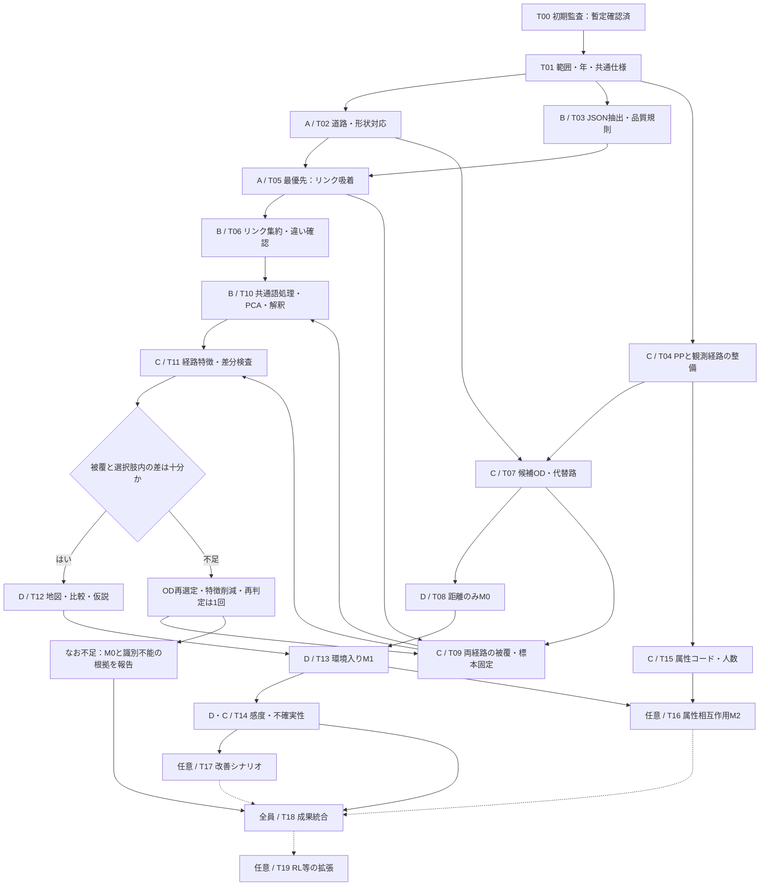

# 豊洲・みちよみを用いた経路選択モデル：実行可能性と4人・2日間の作業計画

作成日：2026-09-08。担当A〜Dはチームの4人に割り当てる仮名。時間は作業開始からの目安で、1日8時間を想定する。

## 1. 判断：小規模な探索的推定には着手できる。ただし環境係数の識別は条件付き

**2021年の徒歩データを主対象に、約3 OD群・100観測程度の経路選択MNLを先に完成させる方針を推奨する。** 配布済み徒歩リンク列と道路ネットワークのIDが対応し、みちよみにも豊洲周辺の記録がある。全GPSの再マッチングや2018〜2021年の一括整備から始める必要はない。

一方、現時点で「VLMの環境係数を安定して推定できる」とまでは確認していない。必要な残条件は、①正しい道路・歩行視点への吸着、②実経路と代替経路の両方の被覆、③同じ選択肢集合内での環境特徴量の差、④有限で安定した推定結果、の4点である。**本計画の完了条件は有意な係数を出すことではなく、妥当なデータで推定し、識別できた範囲と限界を説明すること。**

まず「リンク吸着 → 特徴量の違い確認」を最優先にする。同時に別担当が配布経路の点検・代替路生成と距離のみのモデルを進め、環境データ整備を待ち続けない。

### 今回確認した事実

以下はローカルファイルの再集計。豊洲周辺の仮矩形を **東経139.780〜139.810、北緯35.635〜35.665** とした。この矩形は正式な豊洲境界でも添付資料の対象範囲の再現でもない。件数を混同しないこと。

| 確認項目 | 結果 | 判断への含意 |
|---|---:|---|
| PP 2021 全トリップ／主交通手段が徒歩 | 38,490／14,236件 | 徒歩標本は存在する。豊洲内に限定した件数ではない |
| 2021 `walk/link.csv` | 271,130行、35,168区間 | 他交通手段のアクセス・イグレス徒歩も含み得る。主手段徒歩と区別する |
| 2021 `walk/path.csv` | 有効35,168行、エラー形式8,895行 | 終端ノード欠損等の行を除外してから使う |
| 経路LinkID→ネットワークLinkID | 全行対応 | 同じ道路IDを軸に環境特徴量を結合可能 |
| 経路TripID→PP TripID／DiaryID→feeder ID | ともに全行対応 | Tripと徒歩区間の階層を保持して結合可能。存在確認であり時刻整合の保証ではない |
| 配布行順でのリンク端点の不連続 | 0箇所 | 列順を保てば接続列として利用可能。GPSとの一致・実在通行性は別途点検 |
| 仮矩形内に両ODを持つ主手段徒歩で経路あり | 2,360トリップ、2,365区間、86人 | 最初の抽出母集団。全経路が矩形内とは限らない |
| 上記86人の属性表への結合 | 83人 | 相互作用の候補はある。属性コードの意味は別途確認 |
| 上記区間の厳密な有向ノードOD | 1,322組 | ODを厳密一致だけで絞ると細分化される |
| 頻出OD上位3組 | 52・49・30区間、各7・3・6人 | 計131区間でも人数が少ない。人数は組間で重複し得る |
| 江東区みちよみ | 61,493シーン | `koto.parquet`から開始できる |
| 仮矩形内のみちよみ | 13,954シーン | 全撮影年の合計 |
| 同2018〜2021年／2021年のみ | 3,409／462シーン | PP年との整合と被覆の両立が主要な課題 |
| 仮矩形内の両端を持つ道路 | 3,214有向リンク、端点対1,607組 | 逆方向の重複を分けて集計する必要がある |

簡易な吸着可能性の確認も行った。**CSVの端点を結んだ直線への最近傍30m判定**で、左右・進行方向・撮影視点の選別は未実施。端点対をまとめ、同じ区間に1シーンあればそのリンク全長を被覆と数えた暫定値であり、正式な吸着結果ではない。

| 使用する撮影年 | 30m以内のシーン | 記録の付いた端点対 | 実経路の長さ被覆が80%以上となる徒歩区間 |
|---|---:|---:|---:|
| 全年 | 10,828 | 742 | 1,220 |
| 2018〜2021年 | 2,910 | 431 | 629 |
| 2021年のみ | 356 | 81 | 99 |

代替経路の被覆は未計算。曲線道路、長いリンク、並行道路、鉄道車内画像などを考慮すると結果は変わる。したがって、99件・629件を「推定用の有効標本数」として報告しない。15/30/50mの結果は同梱の監査JSONに保存した。

未集約のシーンには左歩道「あり」7,930件、「なし」323件、「画角外不明」4,954件などの違いがある。しかし、これは**道路リンク間・選択肢間の違いが確認済みという意味ではない**。有効歩行幅の数値は8,806件あるが中央値・第1四分位がともに2.5mで、VLMの丸めや定型出力も点検する。

### 中間報告から引き継ぐもの／再確認するもの

Day1・Day2の「最短とは限らない歩きやすい経路」「属性によるバリア回避選好」という問いを引き継ぐ。Day2のMNLを最初の到達点とし、RLは追加課題とする。

資料に記載された **4,645トリップ・258人・被覆80%以上、遠回り63.9%** は既報の予備値として扱う。今回の探索でその抽出処理・分母・被覆定義まで再現できていないため、今回の矩形集計で検証済みとはしない。遠回り率は同じネットワーク・同じOD・距離定義で再計算し、GPS誤差や途上活動を除いた後に解釈する。

## 2. 添付論文から採用する流れ

木崎ほか「街路景観を考慮した歩行者経路選択モデルに基づく街路空間整備評価」（土木学会論文集80巻20号、24-20064）の第3〜5章を参考にする。[J-STAGE本文](https://www.jstage.jst.go.jp/article/jscejj/80/20/80_24-20064/_pdf/-char/ja)

論文では、PPの徒歩行動を整理し、街路画像から景観要素を抽出し、PCAで構造を読み取った後に解釈可能な景観変数を作り、RL型モデルに組み込んでいる。第5章では6変数にPCAを行い、累積寄与率80%超の4成分を解釈し、元の景観要素を使った5つの変数へ組み直している。**PCAの各軸が自動的に「安全性」等になる、という方法ではない。**

今回も「データ整備 → 特徴量の構造確認 → 解釈 → 推定 → 改善の試算」という順序を採用する。画像の画素量とVLMの言語特徴量は同じ測定量ではないので、論文の変数式・係数や割引率をそのまま転用しない。2日間の基本計画では、PCA得点を使うMNLを先に試し、軸の解釈が難しい場合は事前に定義した少数の構造化変数へ戻す。施策評価はその変数が測っている範囲に限定する。

## 3. データ結合と吸着の仕様を最初に固定する

### 結合の軸

```text
PP trip：year + TripID（UserIDと整合確認）
  └ feeder：year + ID、TripID、UserID
       └ route区間：year + MonitorID + DiaryID + TripID
            └ routeリンク列：上記キー + seq + LinkID
                 └ CSV歩行ネットワーク：LinkID
                      └ みちよみ吸着：scene_id → LinkID / physical_segment_id

属性：PP UserID → ID_panel_surveyの当該年UserID → 当該年monitorID → 属性表ID
```

- 2021年では`MonitorID`にPPの数値UserID、`DiaryID`にfeederのIDが対応している。名前だけで属性表の文字列IDへ直接結合しない。キーの一意性、UserID・時刻・モードの一致を確認する。
- `TripID`だけで徒歩区間を連結しない。最初は主交通手段500のうち単一の整合した徒歩区間を優先し、複数区間・長い滞在・周回散策は別枠にする。
- `Link_Dep_Time`が同時刻になる行があるため、原ファイル行順を`seq`として保存する。ソートで経路を壊さない。
- CSVネットワークでは`ONodeLat`に139度台、`ONodeLon`に35度台の値が入っている。node.csvでも同様。実値と地図照合に基づき正規化し、元列は保持する。距離はメートル系座標で求める。
- ネットワーク`length`は先頭レコードでは0.542などkmと整合する値、経路の`Link_Length(m)`はm。全体照合を行ってから単位を固定する。所要時間・速度には異常値があるため、最初は検証済みのリンク長を使う。
- **shapefileの`ID`とCSVの`LinkID`は同じではない。** 全CSV ID集合と仮矩形のshapefile ID集合に直接の重なりはなかった。端点・向き・長さ・形状で対応表を作り、重複や未対応を記録する。固定の差分加算で対応させない。
- shapefileはCRS情報が未設定だった。座標値・配布資料・既知地点で確認してCRSを設定し、その後に投影する。今回の簡易監査のWGS84仮定を正式仕様として無条件に引き継がない。

### 吸着と品質管理

1. 豊洲周辺の対象ネットワークと探索用バッファを決める。OD間の橋や迂回路を切らない。江東区外を含める場合は中央区等のParquetも追加する。
2. 曲線形状への最近傍候補を生成する。初期距離閾値30m、感度確認15m・50m。閾値は暫定であり、目視点検で調整する。
3. 撮影方向、進行方向、シーケンス、歩道側、高架・地上、交差点を確認する。正逆リンクに同距離となるだけなら物理区間として集約し、方向が判定できる場合のみ有向リンクに分ける。左右情報はカメラ方向に対する左右である。
4. `quarantined`、分析失敗、鉄道車内、道路外、強い遮蔽、歩行環境が評価不能のシーンを選別する。実際に「車内の手すりで路面が見えない」という撮影上の制約が`risk_cues`に入っていた。これを道路危険度にしない。
5. `scene_id`、吸着先、距離、候補の曖昧さ、撮影年、採否理由を保存する。シーン数が多いリンクを高効用と誤認しないよう、位置・撮影系列・年の重複を抑えてからリンク特徴量を集約する。
6. 長いリンクは1点だけで全長観測済みにしない。画像の分布・最大空白距離を点検し、必要なら区間ごとに集約する。未観測と「歩道なし」「緑なし」を分ける。
7. 幹線道路・路地・水辺・交差点・高架周辺を含む最低30例を点検する。幹線／路地は地図や独立した道路属性で分類し、検証したいVLM語だけで分類しない。

### 年の扱い

2021年撮影を第一候補とするが、撮影月もPP観測日と照合する。不足時は2018〜2021年から観測日に近いシーンを、採用規則を決めて使う。古い画像で工事・再開発がある場所は保留する。**2022年以降の画像を2021年当時の状態として主分析へ無条件に入れない。** 後年画像は空間的対応の試験や感度分析に分ける。撮影年代と実際の通行当日の時間帯・混雑は別物である。

## 4. 「ピーキー化」とPCAを推定可能な変数にする

### 先に小さく作る

最初は`analysis`の関連する構造化欄に限定する。有効歩行幅、歩道の有無、歩車分離、視認性、点字、段差・勾配、植栽、店舗などから、欠損と信頼度を点検した10〜20程度の候補を作る。自然言語の語彙経路も残すが、全JSONのBoWをいきなり作らない。`image_file`や「不明」「確認できない」などが主成分を支配していないか確認する。

| 処理 | 実施内容 | 成果・注意点 |
|---|---|---|
| 語彙整理 | 関連欄の語・句を抽出、表記統一、否定を保持 | 「歩道あり／なし」「見通し良好／不良」を区別。「事故」の単語を事故件数と扱わない |
| リンク集約 | シーンごとの語出現を集約し観測量で正規化 | 写真枚数・文章長の違いを道路特性にしない |
| 共通語処理 | 高文書頻度語・低分散列の除去、TF-IDF等、平均中心化 | 平均を引くだけでは分散は増えず、同一特徴から違いは生まれない |
| 稀少語処理 | 数リンクだけの誤認・固有名・表記ゆれを抑制 | 稀少＝有用ではない。候補OD内でも出現・差分があるか確認 |
| PCA | 小さな数値行列は中心化・必要な標準化後にPCA | 3〜5軸を候補とし、寄与率・負荷量・安定性で選ぶ。3軸でも説明できなければ無理に命名しない |
| 高次元語彙の代案 | 疎なTF-IDFならTruncated SVDも候補 | 中心化PCAと同一ではない。使用法を明記し、巨大な密行列化を避ける |
| 解釈 | 正負の上位語・構造化項目と代表リンクを並べる | 「安全性」は仮の解釈。実際の事故率や歩行者の感情の測定ではない |
| 識別確認 | 選択肢内で中心化した経路変数の分散・階数・相関を確認 | リンク間で違っても実路と代替路が同じ特徴なら係数は識別できない |

PCAは欠損をそのまま処理できない。まず観測が十分な特徴とリンクに限定する。補完する場合は観測リンクから求めた中央値等と欠損フラグを使い、未観測を0に置かない。補完なしの小標本でも結果を比較する。評価用の個人を分ける場合は、語彙・補完値・標準化・PCAを学習側で固定して評価側に適用する。

「明るさ」は昼夜や撮影条件、「賑やかさ」は撮影時の一時的活動に支配され得る。初回は静的な歩行環境を優先する。`green_ratio`も緑色画素の指標であり、植生の正確な面積比と断定しない。

## 5. OD選定・経路比較・最小モデル

### ODと標本

約3 OD群・100観測は作業上の目安であり、必要標本数の保証ではない。**頻度、異なる個人数、実路／代替路の被覆、実行可能な選択肢数**で候補を順位付けする。期待する係数の符号や遠回りの大きさを理由に標本を選ばない。

ノードODが細かすぎる場合は約100m程度の出発・到着ゾーンで候補をまとめる。ただし経路生成は各観測の実際のノードODで行う。片方向・逆方向は区別する。1人の反復観測が支配しないよう上限・層化抽出と乱数seedを固定し、人数と件数を併記する。頻出上位3組だけでは人数が少ないため、必要なら3群に固執せず候補ODを追加する。

### 選択肢集合

同じ歩行ネットワーク上で **観測経路＋第1最短路＋第2・第3最短路** を候補にする。長さは全経路で共通のネットワーク長を使用する。観測路が最短路と一致する場合は1つに統合してchosenを1にする。距離が等しいだけで経路を同一扱いしない。

平行辺や逆向きIDによる見せかけの別経路を除き、物理的に異なる経路を残す。単純なノードグラフへの変換で異なる歩道を消さない。到達可能性、徒歩通行可能性、同一OD、連続性、ループを確認する。第2・第3最短路が実質同じなら、重複の少ない迂回候補を共通規則で生成する。

観測路だけを特別に追加する選択肢生成は選択依存性を持つ。初回MNLは**構成した選択肢集合に条件付けた探索結果**と位置づける。候補数・生成法・経路重複を変えて感度を確認し、本格的な母集団推論には選択肢サンプリングの扱いやRLへの拡張を検討する。観測路に特有の定数や「観測経路である」説明変数を入れない。

### 経路特徴量と仮説図

リンク長を`length_km`、リンク特徴を`z_lk`として、基本の経路変数を `X_rk = Σ(length_km_l × z_lk)` とする。単純な語数・リンク本数は画像密度やネットワーク分割に左右されるため主変数にしない。図では平均値 `X_rk / L_r` と曝露量の両方を示し、長い経路だから多いのかを区別する。

実路と最短路を同じ凡例の地図に重ね、距離差、環境曝露差、被覆率を1組の図表にする。共通区間と分岐した区間を分ける。「遠回り側で歩車分離・植栽が多い」などの仮説は記述的な関連としてまとめ、例外も示す。地図は未観測を灰色にし、数値の低さと区別する。

### 推定の順番

| モデル | 効用の内容 | 実施条件 |
|---|---|---|
| M0：距離のみ | `V_ir = βL L_ir` | 経路生成・尤度計算を先に確認 |
| M1：環境を追加 | `V_ir = βL L_ir + Σ βk X_irk` | 当初は環境1〜3軸。識別が確認できれば3〜5軸まで検討 |
| M2：属性相互作用 | `V_ir = βL L_ir + Σ βk X_irk + γ a_i X_ir,k*` | M1が安定し、属性両群に十分な人数・選択肢内差分があるとき1項だけ追加 |
| 任意：重複補正・RL | 経路重複を考慮したモデル、またはリンク遷移モデル | 必須成果を完成してから。2日間のクリティカルパスに置かない |

選択確率は `P_ir = exp(V_ir) / Σ_s exp(V_is)`、対数尤度は各観測のchosen経路について合計する。chosenは選択肢集合ごとに厳密に1つ。全選択肢で一定の個人属性主効果や共通定数は相殺されるため、そのまま入れない。

「Gender」はコードの意味を確認するまで男女ラベルを付けない。「Age」は実値が1〜5であり、schemaの「年齢（歳）」説明と整合しない。年齢階級の境界を確認できなければ年代名を創作しない。`Own Children`や`Number of Children`は世帯属性であり、**そのトリップで子どもを同伴していることは示さない**。子どもとの同伴効果として解釈しない。空欄は確認せず子ども0人に置換しない。

M0〜M2は同じ標本・選択肢で比較する。係数、標準誤差、対数尤度、AIC、収束、観測数・個人数を保存する。個人単位のクラスタ推定または個人単位ブートストラップを使い、少人数では不確実性を慎重に扱う。分割評価も個人単位とする。完全分離・係数発散・階数不足が起きたら変数を減らし、正則化した場合は無罰則の最尤推定と区別する。

距離係数が負で安定した場合だけ、環境改善に対する等価距離の試算を行う。因果効果とはしない。安全性や性別について期待どおりの符号を得るようデータ・変数を変更しない。

## 6. 4人の担当

| 担当 | 主責務 | 早期に渡すもの | 相互確認 |
|---|---|---|---|
| A：空間・吸着 | ネットワーク正規化、形状対応、VLM吸着、品質判定 | 正規化リンク、吸着表、被覆表 | Bが抽出例の意味と視点を確認 |
| B：言語・特徴量 | JSON抽出、語彙整理、リンク集約、PCA、解釈 | 特徴定義、リンク特徴、負荷量 | Aが空間的な違いを確認 |
| C：行動・経路 | PP結合、区間抽出、属性確認、OD選定、代替路 | 経路リンク列、選択肢、属性表 | Dがchosen・選択肢・識別条件を確認 |
| D：推定・統合 | MNL、検証、差分図、結果・発表の統合 | M0、推定表、統合ノート | Cが観測数と行動解釈を確認 |

BはAの本吸着を待たずJSON抽出規則を作る。Cは空間仕様を共有した後に経路整理を開始する。DはCの小さな経路サンプルでM0を先に動かす。最初の30分で共通キー・単位・出力列を全員で合意する。

## 7. タスク一覧

状態は「確認済＝今回の確認範囲のみ」「未着手」「条件付き」。本吸着・PCA・推定を完了済みとはしない。P0は必須、P1は追加。

| ID | 優先 | タスク | 状態 | 担当 | 主な依存ID | 成果・完了条件 |
|---|---|---|---|---|---|---|
| T00 | P0 | PDF・配布データの初期監査 | 確認済（暫定） | 全員引継ぎ | — | 本計画、監査JSON。未確認事項が明記されている |
| T01 | P0 | 範囲・年・キー・単位・出力仕様を固定 | 未着手 | D／全員 | T00 | `analysis_config`、スキーマ、除外理由一覧 |
| T02 | P0 | CSVと曲線形状の対応、方向・接続の点検 | 未着手 | A | T01 | `links_clean`、形状対応表、未対応リスト |
| T03 | P0 | みちよみ関連欄抽出・撮影品質の採否 | 未着手 | B | T01 | `scene_features`、抽出辞書、欠損・信頼度表 |
| T04 | P0 | PP・feeder・配布経路の結合と区間選別 | 未着手 | C | T01 | `observed_route_links`、区間ごとの除外記録 |
| T05 | P0 | みちよみを道路リンクへ本吸着 | 未着手・最優先 | A | T02,T03 | `scene_link_matches`、距離・曖昧さ・年・採否理由 |
| T06 | P0 | リンク特徴集約、幹線／路地の差の確認 | 未着手 | B | T05 | `link_features_raw`、上位語・分散・欠損・30例の目視表 |
| T07 | P0 | 候補ODの頻度・人数整理、代替路生成 | 未着手 | C | T02,T04 | `candidate_routes`、同一OD・重複・連続性検査 |
| T08 | P0 | 距離のみMNLを先行して推定 | 未着手 | D | T07 | M0の係数・尤度・収束、chosen数の検査 |
| T09 | P0 | 実路・全候補路の被覆を照合し標本を固定 | 未着手 | C（A協力） | T05,T07 | `sample_manifest`、約3 OD群・100観測、人数と脱落数 |
| T10 | P0 | 共通語処理、PCA 3〜5軸候補、解釈 | 未着手 | B | T06,T09 | `link_features`、負荷量・寄与率・前処理設定 |
| T11 | P0 | 経路曝露量の集計と選択肢内の差分検査 | 未着手 | C（B協力） | T09,T10 | `choice_table`、階数・相関・ゼロ差分率 |
| T12 | P0 | 特徴地図と実路／最短路比較、仮説を固定 | 未着手 | D（A協力） | T11 | OD比較図、仮説と反例、欠測を区別した地図 |
| T13 | P0 | 環境入りMNLを推定し同標本のM0と比較 | 未着手 | D | T08,T11,T12 | M1、係数・不確実性・適合度・収束表 |
| T14 | P0 | 年・閾値・経路重複・個人偏りの感度確認 | 未着手 | D（C協力） | T13 | 最低限の感度表、失敗・不安定条件の明示 |
| T15 | P1 | 属性の結合率・コード・群別人数を確定 | 未着手 | C | T04 | `person_attributes`、コード根拠、属性別の有効人数 |
| T16 | P1 | 属性×環境を1項だけ追加 | 条件付き | D | T13,T15 | M2、両群の選択差分、相互作用の不確実性 |
| T17 | P1 | 改善シナリオを1つ試算 | 条件付き | B（D協力） | T14 | 観測範囲内の改善量と経路確率変化。因果効果とは区別 |
| T18 | P0 | 結果・限界・再現手順を統合 | 未着手 | D／全員 | T14 | 最終Markdown、図、推定表、実行順序。T16,T17は完成分だけ追加 |
| T19 | P1 | RL／経路重複補正への拡張 | 条件付き・必須外 | D | T18 | 遷移集合・到達性・計算安定性を確認した追加結果 |

## 8. 依存フロー（Mermaid）



## 9. 2日間の進行と判断時点

| 時間 | A | B | C | D | その時点で確定すること |
|---|---|---|---|---|---|
| 1日目 0〜0.5h | 共通仕様 | 共通仕様 | 共通仕様 | 仕様統合 | 対象年、座標、キー、単位、成果物列 |
| 0.5〜3h | 形状対応・吸着試作 | JSON抽出・品質選別 | 観測経路・OD候補・代替路 | Cから小標本を受けM0準備 | まず1 ODで両データがつながる |
| 3〜5h | 吸着と目視 | リンク集約・語の違い | 被覆・人数で候補絞り | M0実行・不具合修正 | G1：正しく観測されたリンクがある |
| 5〜8h | 誤吸着修正・地図補助 | PCA・軸の解釈 | 標本固定・経路変数 | 比較図・M1着手 | G2：選択肢内の環境差分がある |
| 2日目 0〜3h | 閾値・年の感度素材 | 特徴削減・解釈の確認 | 属性・個人偏り点検 | M1を完成 | G3：有限の係数・尤度・収束 |
| 3〜5h | 図の点検 | 任意の改善シナリオ | 検証用標本・属性群確認 | 感度検証、余力でM2 | 拡張の可否を判断 |
| 5〜8h | 地図を確定 | 変数説明を確定 | 標本フローを確定 | 表・結果・限界を統合 | 発表可能な成果一式 |

### 続行・縮小の規則

- **G1（1日目5h）：** 距離・視点・年の採否理由を説明でき、候補経路にも観測がある。実路のみ高被覆で代替路が未観測ならそのODを主分析に採用しない。80%は当面のスクリーニング値であり、残り20%の扱いを明示する。両路で90%等の厳しい条件も比較する。
- **G2（1日目終了）：** 選択肢内の環境差分行列が採用係数数に対して十分な階数を持つ。全く同じ特徴量なら中心化・PCAでは解決しない。ODを変更するか、差のある構造化変数1〜2個に縮小する。変更は1回を目安とし、整備を無限に続けない。
- **G3（2日目3h）：** M0/M1の収束・有限係数・不確実性を確認する。発散時は入力・単位・chosen・完全分離を点検し、環境変数を減らす。正則化は明記した探索的補助とする。
- **属性拡張：** 片方の群が数人しかいない、コード不明、環境差分が片群でない場合はM2を見送る。性別や世帯構成について一般化しない。
- **環境推定が成立しない場合：** M0が成立すればその結果と環境特徴を識別できなかった理由を報告する。M0も成立しなければ、失敗の診断と必要データを成果にし、数値を捏造したり「推定成功」としない。

## 10. 受け渡し仕様と最終成果

今後の生成物は原データと別の分析用フォルダに保存する。以下の名前は推奨仕様であり、今回すべてを作成したという意味ではない。

| 成果物 | 最小限の列・内容 |
|---|---|
| `analysis_config` | 対象年、範囲、CRS、吸着閾値、撮影年規則、抽出条件、seed |
| `links_clean` | LinkID、physical_segment_id、O/D、length_km、geometry、形状対応の品質 |
| `scene_link_matches` | scene_id（文字列）、LinkIDまたは物理区間ID、distance_m、capture_year、採否・曖昧さ |
| `link_features` | リンクID、採用年、観測数・被覆・信頼度、特徴量、PC得点、欠損フラグ |
| `observed_route_links` | year、UserID、TripID、DiaryID、seq、LinkID |
| `candidate_routes` | choice_set_id、route_id、seq、LinkID、生成方法、chosen |
| `sample_manifest` | 抽出・除外理由、OD群、個人・区間数、年・被覆、学習／評価区分 |
| `choice_table` | 選択肢ごとのlength_km、環境曝露量、被覆率、属性、chosen |
| `model_results` | 同一標本のM0/M1（任意M2）、係数・SE・尤度・AIC・収束・感度結果 |
| 最終報告 | 問い、標本フロー、吸着品質、負荷量・解釈、OD地図、仮説、推定結果、限界 |

最低限そろえる図表は、①吸着と欠測の地図、②リンク特徴量の分布・PCA負荷量、③実路／最短路の地図と特徴差、④M0/M1推定表、⑤標本選別と人数の表。政策シナリオ・RLは必須成果にしない。

## 11. 参照と今回の成果範囲

- [Day2中間報告](/Users/reiichiro/Documents/model26/26/esquisse2/model26_Hiroshima_A_esquisse_day2.pdf)：pp.1,5の目的・推定案、pp.2,4の地図・語彙集計を参照。
- [Day1中間報告](/Users/reiichiro/Documents/model26/26/esquisse1/model26_Hiroshima_A_esquisse_day1.pdf)：研究目的とデータ説明を参照。
- [添付論文](/Users/reiichiro/Downloads/80_24-20064-2.pdf)：第3〜5章を参照。ローカルの日本語抽出・描画に一部問題があったため、J-STAGEの同論文本文も照合した。
- [みちよみREADME](/Users/reiichiro/Documents/model26/michiyomi-tokyo-streetscape/README.md)：撮影年・視点・不明値・生成来歴等を確認。
- [道路README](/Users/reiichiro/Documents/model26/data/network/tokyo-metropolitan-area/README.md)：逆方向リンク追加、ID再付番、重複端点を確認。
- [初期監査結果](/Users/reiichiro/Documents/model26/output/planning/feasibility_audit.json)：今回の集計と暫定吸着可能性。
- [初期監査の再実行用ファイル](/Users/reiichiro/Documents/model26/output/planning/feasibility_audit.py)：元データを書き換えずに集計。Python環境のpandas、pyarrow、numpy、shapely、pyprojを使用。

添付PDFとREADMEの記述は研究内容・データ仕様の参考資料として扱い、ユーザーの依頼とは区別した。今回の実施範囲は実行可能性の初期判断と作業計画の作成であり、正式なリンク吸着・PCA・経路選択推定の実行は今後のタスクである。配布PPの利用範囲表示を引き継ぎ、共有資料には個人の生の位置履歴を掲載しない。みちよみを使用した図表には出典を付す。
